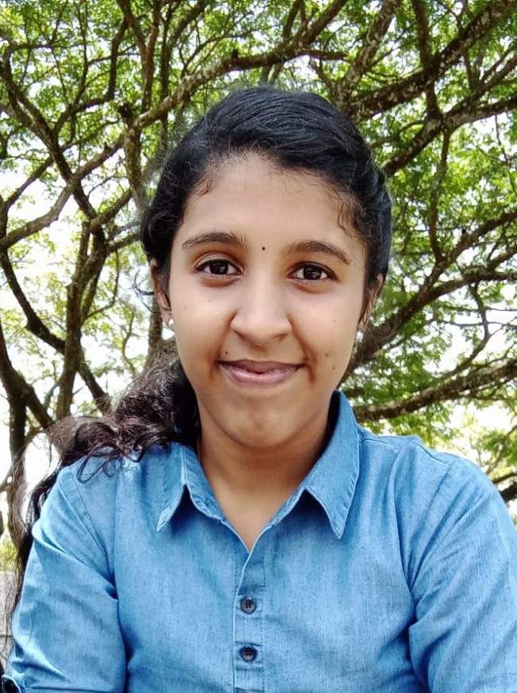

# Aneena V G

## Computer Science & Engineering Undergraduate

  

- **Phone:** 7736624654
- **Location:** Ernakulam, Kerala

## About Me

A self-reliant, driven individual with a solid background in academic knowledge and software engineering. Dedicated to developing personally and professionally with strong interpersonal, team management, and communication skills. Looking to start a career as an entry-level professional with a reputed IT company.

## Education

| **BTech in Computer Science** | **Higher Secondary** | **SSLC** |
| --- | --- | --- |
| SNMIMT Maliankara/Ernakulam | GHSS North Paravur/Ernakulam | St.Anne's HSS Kottpuram/Thrissur |
| CGPA: 9.32 (2020-Present) | Year: 2020, Percentage: 96.5% | Year: 2018, Percentage: 100% |

## Projects

1. 
   - Forum for doubt clarification, assignment distribution, and feedback submission. Teachers actively engage in the forum and respond to course requests. Admin authority includes adding/removing faculties and overall system oversight.

2. 
   - Facilitates passengers to inquire about trains, booking & cancellation of train tickets, and check the status of train tickets.

## Internship

|  |
| --- |
| 05/2023 (15 days) |

## Technical Skills

|  |  |  |  |  |  |  |  |  |
| --- | --- | --- | --- | --- | --- | --- | --- | --- |

## Soft skills

- Adaptive
- Problem Solving
- Team Management
  
## Certifications

|  |  |  |
| --- | --- | --- |
| KKEM & K_DISC | Teachnook, IIT Bhubaneshwar | Devtown 7 Days Bootcamp |

## Position of Responsibility

- **Documentation Committee Head**
  - NSS Unit of College

- **Student Coordinator**
  - Arts Fest 'SAMANWAYA-23'

## Looking forward to...

- **Devoted to continuous learning and personal growth.**
- **Open to collaborative projects and new opportunities.**
